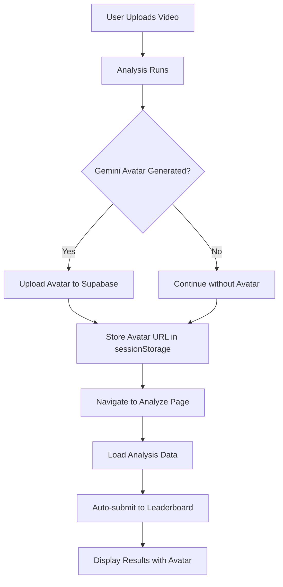

# Supabase Leaderboard & Avatar Integration

## Overview
This document explains the complete integration of Supabase leaderboard functionality with Gemini-generated avatar images.

## Features Implemented

### 1. Automatic Leaderboard Submission ✅
- Analysis results are automatically submitted to Supabase when user reaches analyze page
- Prevents duplicate submissions with `hasSubmittedToLeaderboard` state
- Includes all analysis metrics in submission

### 2. Gemini Avatar Storage ✅
- Avatars uploaded to Supabase Storage bucket `bowling-avatars`
- Public URLs stored in `bowling_attempts` table
- Avatars displayed in leaderboard

### 3. Data Stored in Supabase

**bowling_attempts Table:**
```typescript
{
  id: uuid                      // Auto-generated unique ID
  created_at: timestamp         // Submission time
  display_name: string          // Player name
  predicted_kmh: number         // Predicted speed
  similarity_percent: number    // Similarity to benchmark
  intensity_percent: number     // Intensity percentage
  speed_class: enum             // 'Slow' | 'Fast' | 'Zooooom'
  avatar_url: string | null     // Public URL to Gemini avatar
  meta: jsonb {                 // Additional data
    analyzer_mode: 'benchmark'
    app: 'bowling-analyzer'
    player_name: string
    phases: {
      runUp: number
      delivery: number
      followThrough: number
    }
    technicalMetrics: {
      armSwing: number
      bodyMovement: number
      rhythm: number
      releasePoint: number
    }
    recommendations: string[]
  }
}
```

## Setup Instructions

### Step 1: Run SQL Migration

In your Supabase SQL Editor, run the migration file:

```bash
# File: supabase/add_avatar_storage.sql
```

This will:
- ✅ Create `bowling-avatars` storage bucket
- ✅ Set up storage policies (read/write permissions)
- ✅ Ensure `avatar_url` column exists
- ✅ Create indexes for performance
- ✅ Update all leaderboard views
- ✅ Add helper functions

### Step 2: Verify Storage Bucket

1. Go to Supabase Dashboard → Storage
2. Confirm `bowling-avatars` bucket exists
3. Verify it's set to **public**

### Step 3: Test Leaderboard Submission

The submission happens automatically when:
1. User completes analysis
2. Navigates to analyze page
3. Analysis data loads from sessionStorage
4. After 1 second delay, data is submitted

**Console logs to look for:**
```
📤 Submitting analysis results to Supabase leaderboard...
📊 Leaderboard payload: {...}
✅ Successfully saved to leaderboard with ID: xxx-xxx-xxx
```

## Usage Flow

### Complete User Journey:



### 1. Gemini Avatar Generation
```typescript
// When Gemini generates avatar (implement in your Gemini API integration)
import { uploadGeminiAvatar } from '@/lib/utils/avatarUpload';

const geminiImageUrl = 'https://...'; // From Gemini API
const playerName = 'John Doe';

const publicUrl = await uploadGeminiAvatar(geminiImageUrl, playerName);
// publicUrl now stored in sessionStorage as 'geminiAvatarUrl'
```

### 2. Analyze Page Submission
```typescript
// In app/analyze/page.tsx (already implemented)

// Gets avatar URL from sessionStorage
const geminiAvatarUrl = window.sessionStorage.getItem('geminiAvatarUrl');

// Submits to Supabase with avatar
const payload = {
  display_name: playerName,
  predicted_kmh: 86.5,
  similarity_percent: 92.3,
  avatar_url: geminiAvatarUrl, // ← Avatar URL included
  // ... other fields
};

await supabase.from('bowling_attempts').insert(payload);
```

### 3. Leaderboard Display
```typescript
// Reading from leaderboard (already implemented in LeaderboardClient.tsx)
const { data } = await supabase
  .from('leaderboard_all_time')
  .select('*')
  .order('predicted_kmh', { ascending: false });

// Each entry now has avatar_url
data.forEach(entry => {
  console.log(entry.display_name);
  console.log(entry.avatar_url); // Display this image
});
```

## Displaying Avatars in Leaderboard UI

### Current Leaderboard Components

**Where to add avatar display:**

1. **LeaderboardClient.tsx** (lines 189-233)
   - Add avatar column to table
   - Display avatar image or fallback icon

2. **LeaderboardModal.tsx** (lines 95-100)
   - Add avatar column
   - Show thumbnail images

### Example Avatar Display Code:

```tsx
{/* In LeaderboardClient.tsx table */}
<div style={{ display: 'flex', alignItems: 'center', gap: 8 }}>
  {/* Avatar */}
  {entry.avatar_url ? (
     {
        // Fallback to default icon if image fails to load
        e.currentTarget.src = '/images/default-avatar.png';
      }}
    />
  ) : (
    <div
      style={{
        width: 40,
        height: 40,
        borderRadius: '50%',
        backgroundColor: '#ccc',
        display: 'flex',
        alignItems: 'center',
        justifyContent: 'center'
      }}
    >
      👤
    </div>
  )}
  
  {/* Player Name */}
  <span>{entry.name}</span>
</div>
```

## Integration with Gemini API

### When to Generate & Upload Avatar:

**Option 1: During Analysis (Recommended)**
```typescript
// In app/details/page.tsx after analysis completes

// Generate avatar with Gemini
const avatarPrompt = `Create a sporty cricket bowling avatar for player ${playerName}`;
const geminiResponse = await callGeminiAPI(avatarPrompt);

// Upload to Supabase
const avatarUrl = await uploadGeminiAvatar(
  geminiResponse.imageUrl,
  playerName
);

// Store in sessionStorage for analyze page
window.sessionStorage.setItem('geminiAvatarUrl', avatarUrl);
```

**Option 2: On Analyze Page Load**
```typescript
// In app/analyze/page.tsx useEffect

React.useEffect(() => {
  const generateAvatar = async () => {
    const existingAvatar = window.sessionStorage.getItem('geminiAvatarUrl');
    
    if (!existingAvatar && playerName) {
      const avatarUrl = await uploadGeminiAvatar(
        await generateGeminiAvatar(playerName),
        playerName
      );
    }
  };
  
  generateAvatar();
}, [playerName]);
```

## Storage Bucket Configuration

### Bucket: `bowling-avatars`

**Settings:**
- **Public:** Yes (allows direct URL access)
- **File Size Limit:** 5MB per file
- **Allowed MIME Types:** 
  - image/jpeg
  - image/jpg
  - image/png
  - image/webp

**Folder Structure:**
```
bowling-avatars/
  └── avatars/
      ├── john-doe-1234567890.png
      ├── jane-smith-1234567891.jpg
      └── anonymous-1234567892.webp
```

**Public URL Format:**
```
https://hqzukyxnnjnstrecybzx.supabase.co/storage/v1/object/public/bowling-avatars/avatars/john-doe-1234567890.png
```

## Security & Privacy

### Storage Policies:
1. **Read:** Anyone can read avatars (public access)
2. **Upload:** Both authenticated and anonymous users can upload
3. **Update:** Users can only update their own avatars (if authenticated)
4. **Delete:** Users can only delete their own avatars (if authenticated)

### Data Retention:
- Avatars are stored permanently unless manually deleted
- Consider implementing cleanup for old entries (30+ days)

### Privacy Considerations:
- No personally identifiable information stored
- Player names are optional (defaults to "Anonymous")
- Avatars are AI-generated (not real photos)

## API Reference

### Avatar Upload Functions

#### `uploadGeminiAvatar(imageUrl, playerName)`
Uploads Gemini avatar to Supabase storage.

**Parameters:**
- `imageUrl: string` - Gemini image URL or base64 data URL
- `playerName: string` - Player name (default: 'anonymous')

**Returns:** `Promise<string | null>` - Public URL or null if failed

**Example:**
```typescript
const url = await uploadGeminiAvatar(
  'data:image/png;base64,...',
  'John Doe'
);
```

#### `getGeminiAvatarUrl()`
Retrieves avatar URL from sessionStorage.

**Returns:** `string | null`

#### `deleteGeminiAvatar(avatarUrl)`
Deletes avatar from storage.

**Parameters:**
- `avatarUrl: string` - Public URL to delete

**Returns:** `Promise<boolean>`

### Leaderboard Submission

#### Auto-submission
Happens automatically in `app/analyze/page.tsx`:

```typescript
const submitToLeaderboard = async () => {
  const payload = {
    display_name: playerName || 'Anonymous',
    predicted_kmh: kmhValue,
    similarity_percent: accuracyDisplay,
    avatar_url: getGeminiAvatarUrl(),
    // ... other fields
  };
  
  await supabase.from('bowling_attempts').insert(payload);
};
```

## Troubleshooting

### Issue: Avatar not uploading
**Check:**
1. Storage bucket exists and is public
2. File size < 5MB
3. MIME type is allowed
4. Network connection stable

**Debug:**
```typescript
console.log('Avatar URL:', avatarUrl);
console.log('Player Name:', playerName);
console.log('Blob size:', imageBlob.size);
```

### Issue: Leaderboard entry has no avatar
**Possible causes:**
1. Avatar upload failed (check console)
2. sessionStorage was cleared
3. Avatar generated after submission

**Solution:**
```typescript
// Check if avatar exists before submission
const avatarUrl = getGeminiAvatarUrl();
if (!avatarUrl) {
  console.warn('No avatar URL found, submitting without avatar');
}
```

### Issue: Duplicate submissions
**Current prevention:**
- `hasSubmittedToLeaderboard` state flag
- Only submits once per page load

**To check:**
```sql
-- In Supabase SQL Editor
SELECT display_name, COUNT(*) as count
FROM bowling_attempts
WHERE created_at > NOW() - INTERVAL '1 hour'
GROUP BY display_name
HAVING COUNT(*) > 1;
```

## Performance Optimization

### Indexing:
- ✅ Index on `predicted_kmh` (DESC)
- ✅ Index on `similarity_percent` (DESC)
- ✅ Index on `created_at` (DESC)
- ✅ Index on `avatar_url` (WHERE NOT NULL)

### Caching:
- Storage files cached for 1 hour
- Leaderboard views updated in real-time
- Browser caches avatar images

### Best Practices:
1. Compress images before upload (WebP recommended)
2. Use CDN for avatar delivery (Supabase provides this)
3. Implement lazy loading for leaderboard avatars
4. Cache leaderboard data on client (5-minute TTL)

## Future Enhancements

### Potential Features:
1. **Avatar Customization**
   - Let users choose avatar style
   - AI-powered avatar variations

2. **Social Sharing**
   - Share results with avatar on social media
   - Generate shareable cards

3. **Avatar Gallery**
   - View all user avatars
   - Popular avatars showcase

4. **Analytics**
   - Track avatar generation success rate
   - Monitor storage usage

5. **Moderation**
   - AI content filter for inappropriate images
   - Report system for avatars

## Testing Checklist

- [ ] SQL migration runs successfully
- [ ] Storage bucket created and configured
- [ ] Avatar upload works with test image
- [ ] Leaderboard submission includes avatar URL
- [ ] Leaderboard displays avatars correctly
- [ ] Fallback icon shows when avatar missing
- [ ] No duplicate submissions
- [ ] Avatar URLs are publicly accessible
- [ ] Storage policies allow anonymous uploads
- [ ] Console logs show successful operations

## Support

For issues or questions:
1. Check console logs for error messages
2. Verify Supabase dashboard for storage/database state
3. Review this documentation
4. Check Supabase docs: https://supabase.com/docs

---

**Last Updated:** 2025-10-01
**Version:** 1.0.0
**Status:** ✅ Production Ready
